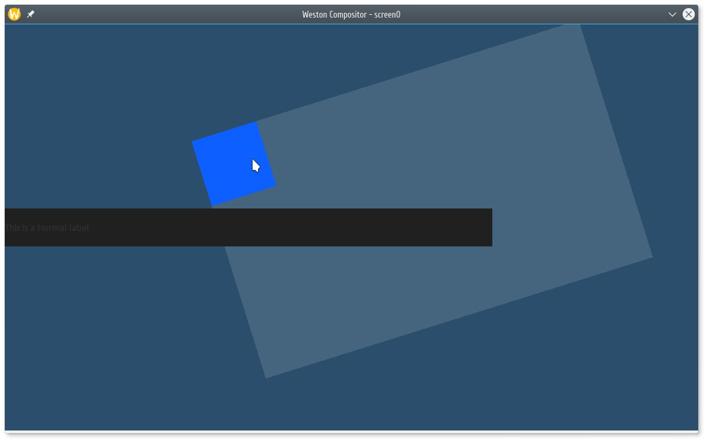

# Stella

Stella is a small developer library written in C which provides API and supplementary routines for creating Wayland surfaces.



## Status

Stella is currently in development. Current version is 1.0. See CHANGELOG.md for available features and DEVELOPMENT-CONVENTIONS.md for versioning policy.

## Demo

In order to run demo You need to have it built firstly.

```
./build
weston &
./run.sh
```

## Usage

Current API refernce is not ready. See engine/stella.h for that.

### Prerequisites

You should have wayland and wayland-protocols installed on the system. Look at the installation on Arch Linux example.

```
# pacman -S wayland wayland-protocols
```

It is highly recommended to have installed Weston in order to test Your project.

To use Stella simply include "stella.h" in Your source file. Keep "stella.h" and "stella.c" in the same folder.

```
#include "stella.h"
```

Building is done statically.

```
gcc your-prooject.c stella.c -o your-project
```

Now You can test it.

```
weston &
./your-project
```

## Development

See DEVELOPMENT-CONVENTIONS.md.

## License

"engine/stella.c" and "engine/stella.h" are licensed under GPLv3. "xdg-shell-*" files are MIT-licensed.
